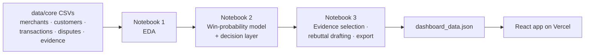

# SaHaYa — Saboot Hai Yahan

Decides whether a card chargeback is worth contesting, assembles the evidence the network requires, and drafts the response.

**Live demo:** https://razorpay-buildathon.vercel.app/
**Track:** Razorpay AI Buildathon, Track 02 — AI Risk Manager

SaHaYa ("saboot hai yahan" — the evidence is here) is a dispute-response console for Indian card merchants. It predicts the odds of winning a chargeback, checks what evidence the card network requires for that specific claim type, and only recommends fighting when the expected recovery beats the filing cost.

## The problem

When a customer disputes a card payment, the bank debits the merchant immediately — before anyone reviews anything. The merchant gets one narrow window to submit evidence and argue for the money back. Two things make this hard: every claim type needs different documents (a "goods not received" dispute needs a delivery confirmation; an "unauthorised transaction" needs 3DS authentication status), and contesting costs a non-refundable filing fee regardless of outcome, so fighting everything is as wrong as fighting nothing. Small merchants generally know neither which documents matter nor whether a given fight is worth it.

## Why card disputes, not UPI

This is a deliberate scoping decision. Since February 2025, NPCI auto-resolves UPI chargebacks through settlement reconciliation between banks — the merchant submits no evidence and makes no decision. Card disputes work differently: the outcome depends on what evidence the merchant submits, against a specific reason code, before a deadline. That's a judgement problem, and it's where a tool like this creates value. Building for UPI would mean automating a decision nobody gets to make.

## Architecture



The core design decision is a two-stage split, not a single model:

**Stage 1 (machine learning): predict P(win).** Whether a bank rules for the merchant is genuinely uncertain — there's no formula for it, so it's learned from historical outcomes with a calibrated Random Forest.

**Stage 2 (arithmetic): decide.** Given P(win), the decision to contest or accept is `P(win) > breakeven`, where `breakeven = filing_cost / dispute_amount`. This is computed, not learned. Hard-coding a model to rediscover division would be worse engineering than just doing the division.

Evidence selection is a separate, third component: a deterministic lookup against each card network's published per-reason-code requirement rules, not a model. It scores 1.000 on precision, recall, and exact-match because implementing a published rule correctly is expected to be perfect — the correct result of a lookup, not a modelling achievement. It would be a red flag if a *learned* classifier scored that high.

## Results

Measured on a held-out test set of 259 contested disputes (1,034 used for training), the win-prediction model reaches **ROC-AUC ≈ 0.84**. With a few hundred test disputes, the exact decimal moves between runs — treat it as a range, not a fixed number.

Precision and recall differ depending on which decision rule they're measured against:

| Threshold | Precision | Recall |
|---|---|---|
| Economic (what SaHaYa actually uses) | ≈ 0.60 | ≈ 0.66 |
| Standard 0.5 (classification-only view) | ≈ 0.72 | ≈ 0.79 |

They differ because SaHaYa deliberately contests some low-probability, high-value disputes where the payoff still justifies the risk — a decision the economics call for but that a plain 0.5 cutoff wouldn't make. Both numbers describe the same model; they answer different questions.

**The money view**, net recovery on the test set:

| Strategy | Net recovery |
|---|---|
| Always accept | ₹0 |
| Always contest | ₹5,54,168 |
| SaHaYa | ₹6,16,094 |
| Perfect foresight | ₹6,63,279 |

**The segment finding is the real result.** Split by dispute size into quartiles, SaHaYa and blind contesting perform almost identically in the two largest quartiles (Q4, median ₹14,900: SaHaYa ₹5,45,296 vs. always-contest ₹5,34,450) — most disputes there are worth fighting regardless. The difference concentrates in small disputes: in Q1 (median ₹797, median breakeven ≈ 100% of the claim), always-contesting loses ₹26,863 net, while SaHaYa's selective declines net ₹61. In Q2 (median ₹1,499), always-contest loses ₹1,130 against SaHaYa's ₹11,661. Overall uplift over always-contesting is ₹61,926 — modest in aggregate, because most disputes clear the bar to fight anyway, and concentrated exactly where the filing fee approaches the disputed amount.

## Design

The interface follows Razorpay's Blade design system: Prussian Blue (`#012652`) and Dodger Blue (`#0D94FB`), 4px border radius throughout, borders rather than shadows, tabular numerals for all figures, data-dense over decorative. SaHaYa is an independent tool built on Razorpay's dispute schema for this submission — not a Razorpay product, and not Razorpay-endorsed.

## Defense-only compliance

- Evidence is never fabricated. The rebuttal generator is template-driven and can only insert values that already exist in the merchant's own records.
- Missing documents are disclosed in the drafted response, not hidden.
- Every recommendation is advisory. A human reviews and submits; nothing is auto-filed.
- Fabrication is structurally impossible by architecture — there is no generative step that could invent a document or a fact — not merely discouraged by an instruction.

## The hard part: building the dataset

No real dispute dataset was available for this track, and no public India-specific chargeback statistics exist at all — not the dispute rate, not the win rate, not the fee structure. All of it was constructed and calibrated against global card-network benchmarks and RBI-published figures, with the gap between "calibrated to global data" and "measured from Indian data" stated openly rather than blurred.

Getting the joins right across merchants, customers, transactions, disputes, and evidence was a real source of failure. One regeneration produced 100% orphaned disputes because `transactions.csv` silently failed to regenerate while every other table did — the new dispute IDs used an 11-character format against the stale transactions file's 10-character one, so every foreign key failed. Row counts and schemas looked identical; only comparing MD5 hashes of each file before and after the run caught it.

Row counts per table were a real constraint. Too few disputes and the held-out test set can't support stable metrics. Too many, and the dispute rate exceeds Visa's 1.5% VAMP monitoring threshold, meaning every merchant would already be flagged for excessive disputes. An early version had demo merchants at 5–7% dispute rates, because a "minimum 40 disputes per demo merchant" rule pushed the rate past what a healthy merchant would show. The final dataset holds the aggregate card dispute rate at 0.632%, safely under the VAMP line.

Semantic coherence was the hardest failure to catch. An early dataset passed every statistical test — distributions, correlations, leakage checks, calibration — while containing 232 "goods not received" disputes at merchants that ship nothing physical: SaaS companies, gym memberships, travel bookings. A SaaS company cannot fail to deliver goods it never shipped, and no aggregate check catches that; only reading individual rows does. The generator now gates which reason codes are possible per merchant archetype as a hard assertion.

The merchant archetypes were their own trade-off: too many and each is thin and inconsistent; too few and they stop demonstrating anything different. The dataset settled on seven — `d2c_brand`, `social_seller`, `marketplace_retailer`, `subscription_edtech`, `saas_tools`, `fitness_membership`, `travel_booking` — each with a genuinely different evidence situation: a gym's decisive evidence is attendance records, a SaaS company's is access logs, a D2C brand's is a signed delivery slip.

Transaction pricing realism mattered too: subscription businesses have 3–4 fixed price points, not 800 distinct amounts, and Indian retail prices overwhelmingly end in 9, 0, or 5, not arbitrary paise. The final distribution matches that.

## What broke, and how I got out

Three failures shaped this build, and none were caught the way I expected.

The silent non-regeneration above: a script reported success while one output file quietly stayed stale, leaving zero valid dispute-to-transaction links. Row counts and schemas matched; nothing in a summary statistic looked wrong. Only hashing every output file before and after a run, and diffing the hashes, caught it.

The semantically impossible disputes — 232 "goods not received" claims against merchants with nothing to ship — passed every statistical gate: distribution shape, correlation structure, leakage checks, calibration. The bug was invisible to anything looking at aggregates; I only found it by reading a sample of individual dispute rows against each merchant's business type, by hand.

A precision number meant something different from what it looked like. An early report quoted a single "precision" figure for the win-prediction model without saying which decision threshold it was measured at, and it read as inconsistent with the reported recall until I traced both back to the economic threshold versus the standard 0.5 cutoff — two different questions about the same model, easy to conflate if the threshold isn't named next to the number.

The lesson that generalises: statistical validation is necessary and not sufficient. A row, or a whole table, can satisfy every distributional check and still be nonsense — only reading it, with the domain in mind, catches that.

## Known limitations

- Synthetic data, calibrated to global card-network benchmarks. No India-specific chargeback statistics are publicly published to calibrate against directly.
- Win outcomes are modelled from a documented latent logit function, not observed real bank decisions.
- The contest-fee range is a modelled assumption, not sourced from a published fee schedule — none exists publicly for the Indian market. What is real is that contesting has a non-zero, non-refundable cost, which is the property the decision layer depends on.
- The test set is 259 contested disputes; metrics carry meaningful run-to-run variance at that size.
- Customer identity is merchant-scoped, matching a real single-merchant integration. Cross-merchant abuse patterns are invisible by design.

## Future work

A return-risk scorer and a fraud-spike detector were both in scope for Track 02 and both deliberately left out. The same evidence-and-cost engine generalises to return requests with minimal change, and a fraud-spike detector needs only a rolling baseline over transaction volume. They were cut because building credible synthetic data for three problems in the time available would have meant three shallow builds instead of one deep one. With real merchant data, both become straightforward extensions of this pipeline.

An LLM layer for rebuttal drafting is the other clear next step. The current generator is template-driven, and that boundary is exactly where an LLM would slot in: it would improve tone and fluency, not factual content, since the template already guarantees nothing gets inserted that isn't in the merchant's own records.

## Repository structure

```
data/        Source CSVs and dataset documentation. Frozen.
notebooks/   Three notebooks, run in order: EDA -> model + decision layer -> evidence
             selection, rebuttal drafting, and dashboard export. Outputs in
             notebooks/outputs/, including dashboard_data.json.
src/         Python scripts that generate and validate the synthetic dataset.
app/         The React dashboard (Vite + React 18 + Tailwind + Recharts), on Vercel.
```

## Running it locally

```bash
cd app
npm install
npm run dev      # local dev server
npm run build    # production build
```

The app reads `app/public/dashboard_data.json` at runtime. To regenerate it, run the three notebooks in order — `01_EDA` → `02_ML_Decision_Engine` → `03_Evidence_Responder_Export` — since each stage's outputs feed the next and Notebook 3 writes the file to `notebooks/outputs/dashboard/dashboard_data.json` last. Copy that file to `app/public/` before running the dev server. Re-run all three whenever `data/core/` changes; running Notebook 3 alone against stale Notebook 2 outputs will silently reuse old metrics.
